# README

## Moon Tracker

A small Flask web app that displays the Moon’s current position and the next gate transitions using Swiss Ephemeris. The UI shows current zodiac sign, degree within the sign, Human Design gate, phase and illumination, plus the next lunar cycle of gate changes with timestamps.

### Features

- **Current Moon data**: zodiac sign, degree in sign, Human Design gate, phase, illumination
- **Upcoming gates**: next n gate changes with timestamps (default 32).
- **Lightweight UI**: static HTML/CSS/JS served by Flask
- **External API proxy**: optional `/moonphases` proxy to FarmSense with safe fallback to local calculation

### API

- **GET `/data`**: Returns current Moon data as JSON.
- **GET `/moonphases`**: Proxies FarmSense moon phase API; falls back to local calculation on failure/timeouts.

### How it works

- `src/services.py` uses `pyswisseph` to compute the Moon’s ecliptic longitude for the current UTC time.
- Longitude maps to zodiac sign, degree-in-sign, and a Human Design gate via `src/gates.json`.
- Future gate changes are found by searching for when the Moon crosses the next gate boundary (next 10 shown).
- Phase and illumination are calculated locally as a fallback if the external API is unavailable.

### Project layout

- `app.py`: Flask server and routes (`/`, `/data`, `/moonphases`, static assets)
- `src/services.py`: Moon position, gate detection, phase, future transitions
- `src/assets/`: Frontend (HTML, CSS, JS, images)
- `src/gates.json`: Gate ranges used for lookups

### Swiss Ephemeris and ephemeris files

- Moon Tracker uses **Swiss Ephemeris** via their Python API `pyswisseph` for precise lunar positions (`swe.calc_ut(..., swe.MOON)`).
- Swiss Ephemeris requires binary ephemeris data files to be available at runtime:
  - `semo_18.se1`: lunar ephemeris (Moon)
  - `sepl_18.se1`: planetary ephemeris (used internally by Swiss Ephemeris)
- These files are included in the project root and are loaded automatically when the current working directory contains them.

## Setup and run

- Using Make (Linux/WSL/Git Bash)

  1. `python -m venv .venv`
  2. `source .venv/bin/activate`
  3. `make install`
  4. `make run`

- Manual (Windows PowerShell)

  1. `python -m venv .venv`
  2. `.\\.venv\\Scripts\\Activate`
  3. `pip install -r requirements.txt`
  4. `python app.py`

Open the app: [`http://localhost:5000`](http://localhost:5000)

Stop the server: Press `Ctrl+C` in the terminal

---

```mermaid
graph TD
    A[🌟 Wake up!] --> B{Feeling sleepy?}
    B -->|Yes! 😴| C[☕ Coffee time!]
    B -->|Nope! 🐿️| D[🌈 Be productive!]
    C --> E[💪 Energy level up!]
    D --> E
    E --> F[🎉 Enjoy your day!]
```

