# README

## Setup and run

1. Open terminal in VSCODE with Ubuntu (WSL)

2. ```shell
    source .venv/bin/activate
   ```

3. ```shell
    make install
    ```

4. ```shell
    make run
    ```

5. Open browser on [`http://localhost:5000`Update](http://localhost:5000)

6. Press `ctrl+c` in the terminal to exit te server

---

```mermaid
graph TD
    A[🌟 Wake up!] --> B{Feeling sleepy?}
    B -->|Yes! 😴| C[☕ Coffee time!]
    B -->|Nope! 🐿️| D[🌈 Be productive!]
    C --> E[💪 Energy level up!]
    D --> E
    E --> F[🎉 Enjoy your day!]
```


